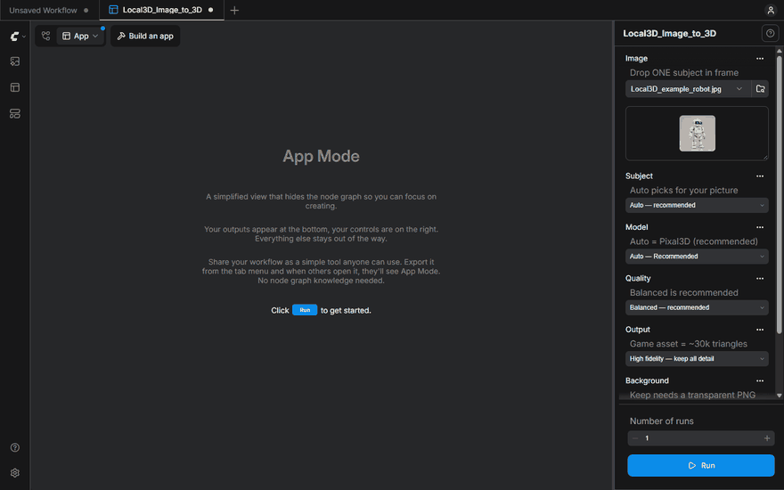
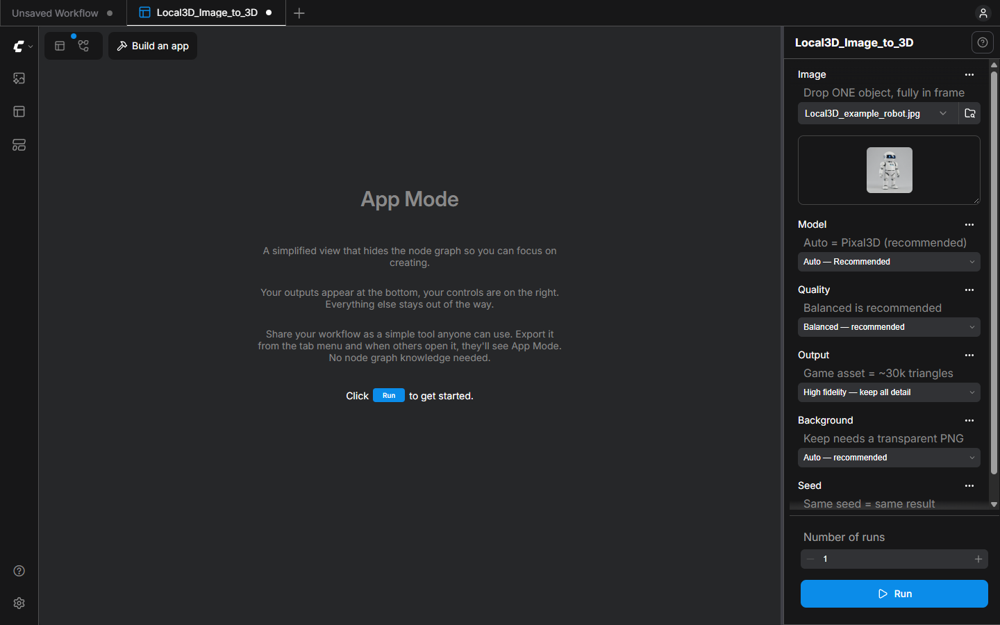
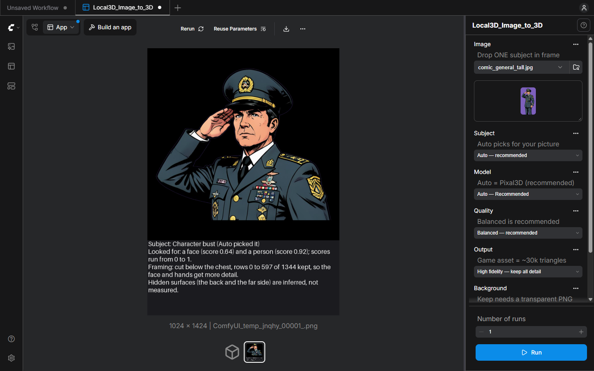
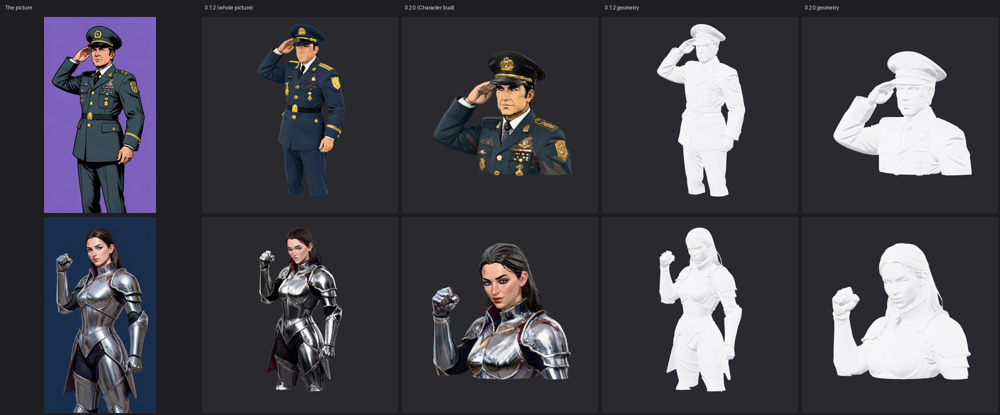

# Local3D

**Turn a photo or a text prompt into a textured 3D model, on your own NVIDIA GPU, offline.**

- **Local and private.** After a one-time download of the models, your pictures, prompts and 3D models never leave your PC. No account, no Local3D telemetry.
- **Simple.** Drop a picture (or type a prompt), pick a quality, press **Run**. No node graph, no Python, no model folders.
- **Open models.** Pixal3D and TRELLIS.2 build the 3D model; FLUX.2 klein draws reference pictures. All run through official ComfyUI.
- **It looks before it builds.** Drop a person or a character and Local3D crops to a bust, so the face and hands get more of the model's resolution; it tells you what it decided and why, and you can overrule it.
- **Real assets.** A UV-unwrapped mesh with PBR (realistic material) textures (base colour, metallic, roughness, normal, occlusion) in one `.glb` file, a standard 3D format that opens in Blender, game engines and most viewers.



## Quick start

Windows 10/11 and an NVIDIA RTX 20-series or newer graphics card (12 GB+ recommended). Developed and tested on Windows 11 with an RTX 5080 only; other setups should work but are untested. About 26 GB of disk space on an RTX 50-series card (up to 36 GB on older cards).

1. Download **Local3D-Setup-0.2.0.exe** from the [latest release](https://github.com/arashsajjadi/Local3D/releases/latest).
   Windows SmartScreen will warn because the installer is not code-signed yet: *More info* > *Run anyway*.
2. Install it, then start **Local3D** from the Start menu.
3. On first start Local3D asks before each download: **OK** for the ComfyUI engine (2 GB, the open-source tool that runs the models), then **Download** for the AI models (15 GB, plus an optional 7 to 16 GB for prompts).
   It resumes if interrupted, and everything is checked against checksums.
4. A sample picture is ready: press **Run**. Or drop your own picture of **one object, fully in frame**. For text prompts, use the *Apps* icon in the left bar (hover over the icons to see their names) or *Start > Local3D tools*.
5. Turn the finished model around in the viewer. It is saved automatically as a `.glb` in `Documents\Local3D\models`, and the download button above the viewer saves a copy anywhere you like. Wait for the viewer to show the result before closing the window: closing it quits Local3D and cancels a model that is still being made.

More detail: [docs/INSTALL.md](docs/INSTALL.md). Something wrong? [docs/TROUBLESHOOTING.md](docs/TROUBLESHOOTING.md).



## What you get

| App | Use it to | Time (RTX 5080, models already loaded) |
| --- | --- | --- |
| **Image to 3D** | turn one picture into a textured 3D model | Fast 38 s, **Balanced 81 s**, Maximum 111 s |
| **Prompt to 3D** | describe an object; Local3D draws a reference picture, then builds the model | Fast about 50 s, Balanced 100 to 190 s |
| **Reference Pictures** | make 1, 2 or 4 candidate pictures from a prompt, then pick the best for *Image to 3D* | about 6 s for four |
| **Character from views** | build a model from 2 or 4 *real* views of the same subject (front, left, back, right): the back is measured, not guessed | about 5 to 7 minutes (its RAM use peaked at about 17 GB here) |

Controls: **Subject** (Auto, Object, Character bust, Complex: see below), **Model** (Auto = Pixal3D, or TRELLIS.2), **Quality** (Fast, Balanced, Maximum), **Output** (High fidelity, or Game asset with
about 30k triangles, for games and apps), **Background** (Auto, Remove, Keep your own transparent PNG) and **Seed**. Times were measured on one machine, not promised: the first row is Pixal3D with models already loaded; TRELLIS.2 and the first run after starting are slower (see [docs/QUALITY.md](docs/QUALITY.md)).

Single-picture 3D *estimates* the sides it cannot see. Show the whole object on a simple background, and treat the back as a good guess.

## People, characters and toys

A picture of a person is a different problem from a picture of a mug, so *Image to 3D* looks first. Two small detectors that run on your PC
(about two seconds) check for a person and a face, and a plain-language **Subject report** (written under the *prepared picture*, the second picture in the row under the model: click it) says what they found and what Local3D did.
The **Subject** control overrules it.

| You drop | Local3D does |
| --- | --- |
| a product, tool, plant, **toy or figurine** | **Object**: the whole picture goes to Pixal3D, as before |
| a person or character, head and shoulders or half length, **in a tall or tightly framed picture** | **Character bust**: the picture is cut below the chest *before* the background is removed, so the face and hands reach the model at a higher resolution |
| a half-length figure in a square picture, a full-length figure, a hidden face | **Object**, with a note in the Subject report saying why. Choose *Character bust* to crop to the upper body yourself |
| thin or open shapes (spokes, leaves, wire) | choose **Complex** to try TRELLIS.2 as a second opinion: on our test fern it kept finer fronds but turned them grey, on a bicycle wheel it did worse than Pixal3D |
| two or four real views of the same subject | open **Character from views** (*Start > Local3D tools*) |





Both characters in this figure are synthetic pictures made for this project; both versions ran at Balanced with the same seed. In 0.1.2 the whole figure shares the model's input, so the
face gets only a small part of it; in 0.2.0 the bust fills it. What still goes wrong, honestly:

* A bust ends below the chest on purpose. The lower body is cut away; choose *Object* to keep the whole figure.
* The hand is better, not solved: the thumb and the fingertips are modelled, but fingers can still be partly fused.
* The back and the far side are still a guess from one picture, and the colour of lenses, the back of the head and some textures change with the seed.
  Shiny metal can show blocky reflections; the general's jacket above shows brown stains. Use *Character from views* when you have real views.
* A bust takes about 1.5 to 2 times as long as the whole picture, because it fills more of the model's input.

How it was decided, measured and checked (including what was tried and left out): [docs/CHARACTER_ROUTING_DECISION.md](docs/CHARACTER_ROUTING_DECISION.md).

## Supported models

| Model | Role | License | Download |
| --- | --- | --- | --- |
| [Pixal3D](https://huggingface.co/TencentARC/Pixal3D) | image to 3D, default | MIT | in the 15 GB pack |
| [TRELLIS.2](https://github.com/microsoft/TRELLIS.2) | image to 3D, alternative for intricate or thin objects | MIT | in the 15 GB pack |
| [FLUX.2 klein 4B](https://huggingface.co/black-forest-labs/FLUX.2-klein-4b-nvfp4) | reference pictures for prompts | Apache-2.0 | optional, 6.6 to 16 GB by GPU |
| [RT-DETR v4](https://github.com/RT-DETRs/RT-DETRv4), [MediaPipe](https://github.com/google-ai-edge/mediapipe) | find a person and a face (subject routing) | Apache-2.0 | in the 15 GB pack (130 MB) |
| Pixal3D multi-view model | *Character from views* | MIT | optional, 5.6 GB, asked for when you first open that app |

Model licenses differ from this project's MIT license; the DINOv3 encoder both 3D models need is under Meta's own license.
See [docs/MODELS.md](docs/MODELS.md) (including why Hunyuan3D and the human-specific models are not included) and [THIRD_PARTY_NOTICES.md](THIRD_PARTY_NOTICES.md).

## Example results

Eight objects chosen to stress different things, each through **both models at Balanced**: every run, including the weak ones.
Left to right: the reference picture, Pixal3D, TRELLIS.2.


* Thin spindles, open tops, small handles and fine gears are kept by both models.
* **Shiny chrome is the weak spot** (see the teapot): reflections turn into blotchy texture.
* Pixal3D stays closer to the picture's colours; TRELLIS.2 sometimes drifts (the basket, the robot's visor).
* One of the 16 runs failed: TRELLIS.2 at Balanced ran out of GPU memory on the knitted hat while other programs held about 5 GB of the card.
  Local3D says what to do in plain words (lower the Quality or switch Model), and your settings stay put.

Details, timings and how the presets were chosen: [docs/QUALITY.md](docs/QUALITY.md).


## Privacy

Generation runs on your PC. Pictures, prompts and meshes are not uploaded anywhere, there is no telemetry, and no account is needed.
The internet is used only for the first-run downloads (the ComfyUI runtime from GitHub, models from Hugging Face). After
that, generation works offline. The diagnostics summary contains versions and hardware only. The app window is Microsoft Edge,
a separate program: its own background connections to Microsoft follow your Windows and Edge privacy settings and are not
controlled by Local3D (Local3D blocks known telemetry hosts inside that window and runs it with its own separate profile).

## How it works

Local3D is a thin layer over official, unmodified [ComfyUI](https://github.com/Comfy-Org/ComfyUI): a tiny launcher starts
it privately on your PC, a set of ComfyUI *App Mode* apps (built only from Comfy Core nodes) provides the simple screens, and the
official 3D nodes do the work. Experts can switch any app to the full graph. See [docs/ARCHITECTURE.md](docs/ARCHITECTURE.md) and
[why ComfyUI rather than LocalAI or Comfy Desktop](docs/ARCHITECTURE_DECISION.md).

## For developers

```
git clone https://github.com/arashsajjadi/Local3D
cd Local3D
python scripts/validate.py && python -m unittest discover -s tests
```
See [CONTRIBUTING.md](CONTRIBUTING.md). Independent project, not affiliated with Comfy Org, Microsoft, Tencent, Meta or Black Forest Labs.
License: [MIT](LICENSE) for this repository's files; runtime and models have their own licenses.

If Local3D is useful to you, consider starring the repository.
