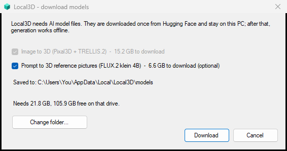
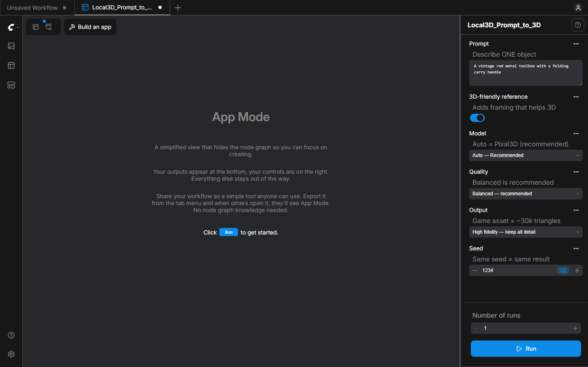

# Install and first start

## What you need

| | |
| --- | --- |
| **Windows** | 10 (version 2004) or 11, 64-bit. Microsoft Edge (already part of Windows). Tested on Windows 11 only; the runtime is unpacked with Windows' own `tar.exe`, which needs a reasonably current Windows 10 (or a free 7-Zip) to open its `.7z` archive |
| **Graphics card** | NVIDIA RTX 20-series or newer with an up-to-date driver (580 or newer recommended). 12 GB of video memory or more is recommended; 16 GB is the comfortable target. Local3D is developed and tested on an RTX 5080 (16 GB). AMD, Intel and Apple GPUs are not supported yet |
| **Memory** | tested with 64 GB of RAM; lower amounts have not been measured |
| **Disk space** | about **26 GB** in total on an RTX 50-series card: 7.4 GB while the runtime unpacks (4.4 GB afterwards), **15.3 GB** for the 3D models and 6.6 GB for *Prompt to 3D*; the prompt files are 12.5 GB on RTX 40-series and 16.1 GB on older cards (up to about 36 GB in total). The optional *Character from views* model adds 5.6 GB. Local3D also keeps 3 GB spare. Models can go on any drive |
| **Internet** | for the first start only (about 2 GB runtime + models). After that, generation works offline |

## Install

1. Download `Local3D-Setup-0.1.2.exe` from the [latest release](https://github.com/arashsajjadi/Local3D/releases/latest)
   (and, if you like, check it: `Get-FileHash .\Local3D-Setup-0.1.2.exe` in PowerShell must print the value in `SHA256SUMS.txt`
   on the same page; the release also carries a GitHub build-provenance attestation).
2. Run it. Windows may show **"Windows protected your PC"** because the installer is not code-signed yet:
   click **More info**, then **Run anyway**. If your antivirus removes `Local3D.exe`, see [TROUBLESHOOTING.md](TROUBLESHOOTING.md).
   No administrator rights are needed; by default it installs for your user only (Setup also offers an all-users install, which asks for them).
3. Leave *Start Local3D now* ticked and finish.

The installer is only about 2 MB. It does not download anything.

## First start (once)

1. **Runtime.** Local3D asks before downloading the ComfyUI runtime (about 2 GB, the official release from
   github.com/Comfy-Org/ComfyUI). It is checked against a checksum, unpacked, and takes about a minute on a fast connection.
2. **Models.** A window shows what is needed, how big it is, where it will be saved and how much space is free:
   * *Image to 3D* (15.3 GB, including two small subject detectors) is required.
   * *Prompt to 3D* reference pictures (6.6 GB on RTX 50-series, 12.5 GB on RTX 40-series, 16.1 GB on older cards) is optional.
   * *Character from views* (5.6 GB) is optional and is asked for only when you first open that app.
   Use **Change folder...** to put them on another drive. Downloads can be interrupted at any time and resume.

   

3. The **app window** opens. The very first start of the engine takes about half a minute longer than later ones.

You never see a console window, a Python install, a model folder or a node graph.

## Use it

* **Image to 3D** opens first. A sample picture is already selected; press **Run** to try it, or drop your own picture
  (one object, or one person or character, fully visible). Pick *Quality*: **Balanced** is recommended; *Fast* is a quick preview; *Maximum* needs
  the most GPU memory. Leave **Subject** on *Auto*: Local3D looks at the picture, crops a person to a bust when that helps, and
  prints what it decided under the result. Choose *Object*, *Character bust* or *Complex* yourself when you know better.
* **Character from views**: *Start > Local3D tools > Character from views*. Give it two or four real views of the same subject (front,
  left, back, right) and it builds the model from them; the back and the far side are measured, not guessed. The first time, it asks to download a 5.6 GB model.
* **Prompt to 3D**: *Start > Local3D tools > Prompt to 3D*, or use the *Apps* button in the left bar of the window.
  Type what you want and press **Run**.

  

* Closing the app window quits Local3D and cancels a model that is still being made: wait for the viewer to show the result.
* **Reference pictures** makes up to four candidates in seconds. Pick the best, then choose it in *Image to 3D*. If the new
  pictures are not in that app's picture list yet, press **R** (refresh) or reopen the app.

Results are in **`Documents\Local3D\models\`** as `.glb` files. The 3D viewer shows the model; drag to rotate, scroll to
zoom, right-drag to pan. Each run also appears in the app's history.

## Start menu and pinning

The installer adds **Local3D** to the Start menu (type "Local3D" after pressing the Windows key). Windows does not allow
programs to pin themselves: to pin it, right-click the Start menu entry and choose **Pin to Start** (or **Pin to taskbar**).
Extra shortcuts (Prompt to 3D, Character from views, Reference pictures, Download more models, Diagnostics) are in the **Local3D tools** folder.

## Where things are

| | |
| --- | --- |
| Program | `%LOCALAPPDATA%\Programs\Local3D` (or `C:\Program Files\Local3D` for an all-users install) |
| Runtime, logs, settings, workspace | `%LOCALAPPDATA%\Local3D` |
| Model files | `%LOCALAPPDATA%\Local3D\models` or the folder you chose |
| Your results | `Documents\Local3D` (your real Documents folder, which OneDrive may sync; set `outputDir` in `settings.json` to put them elsewhere) |

To move the runtime or models, create `%LOCALAPPDATA%\Local3D\settings.json` before first start (forward slashes are easiest):
`{"dataDir": "D:/Local3D/data", "modelsDir": "D:/Local3D/models"}`.
A model folder you already have from ComfyUI works too: files that match the pinned checksums are verified and reused, never downloaded again.
A file with the same name but different content in that folder is replaced by the version Local3D was tested with, so give Local3D its own folder if you want to keep other versions.

## Update and uninstall

* **Update:** run the newer installer over the old one. Your runtime, models and results are kept. Updating from 0.1.x, Local3D asks once before
  downloading two small subject detectors (130 MB); nothing else is fetched.
* **Uninstall:** *Settings > Apps > Local3D*. It asks whether to also remove the runtime, logs and settings, and then, separately,
  whether to delete the downloaded model files (the default answer is No, so a reinstall is quick). A models folder you chose
  yourself and `Documents\Local3D` are never deleted.

## Already use ComfyUI?

The apps are a standard ComfyUI custom-node folder. With **ComfyUI 0.35 or newer** (0.38 tested), copy
`local3d_pack` into `ComfyUI\custom_nodes`, put the models from `data/models.json` in the usual model folders, restart, and
find the apps under *Templates > Extensions*. Open the *Apps* sidebar after saving them as workflows, or use the link
`/?template=Local3D_Image_to_3D.app&source=local3d_pack&mode=linear`. You still get the full graph: switch the app
to *Graph* with the toggle at the top. *Image to 3D* also needs the two detector files from `data/models.json` (`detection/mediapipe_face_fp32.safetensors` and
`diffusion_models/rt_detr_v4-x-hgnet_fp16.safetensors`), and *Character from views* the multi-view model in the `multiview` pack.
The *Prompt to 3D* and *Reference Pictures* apps are copied for RTX 50-series cards (nvfp4 weights);
on an RTX 40-series card copy `local3d_pack\variants\ada\*.app.json` over `example_workflows` (RTX 20/30-series: `variants\legacy`) and download
only the *Prompt to 3D* files in `data/models.json` whose `gpu` list contains your class or has none.

## Unattended or scripted install

```
Local3D-Setup-0.1.2.exe /VERYSILENT /SUPPRESSMSGBOXES /NORESTART
"%LOCALAPPDATA%\Programs\Local3D\Local3D.exe" --yes
```
`--yes` accepts the default of every consent dialog (downloads the runtime and the models for your GPU, but not the optional *Character from views* model). It is not headless: afterwards
Local3D starts and opens the app window, and the command keeps running until that window is closed, so run it detached or from an
interactive user session. Without Microsoft Edge, Local3D opens your default browser instead (and then stays open until you click *Quit*).
