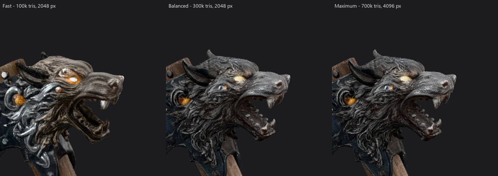
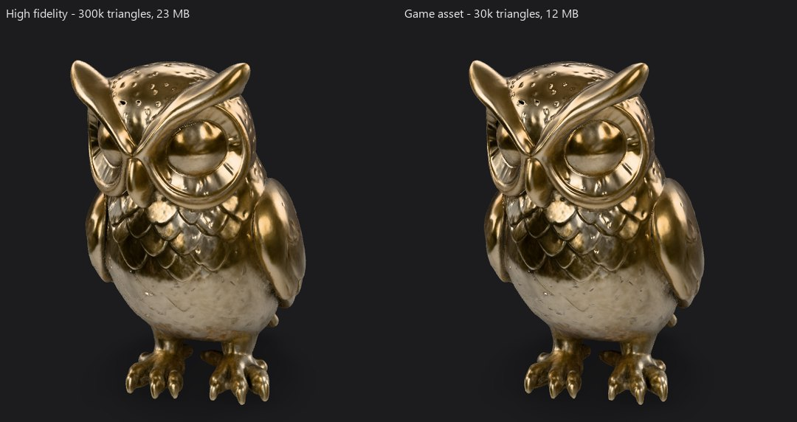
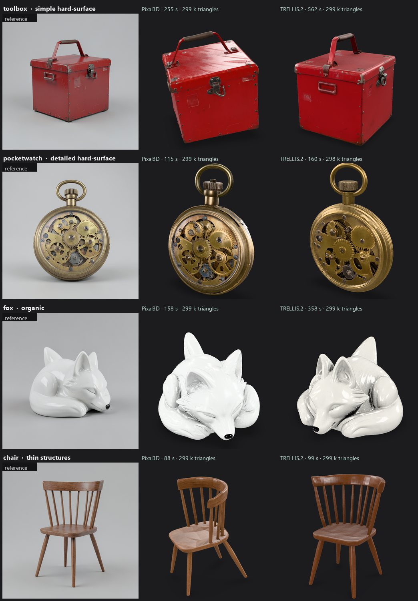
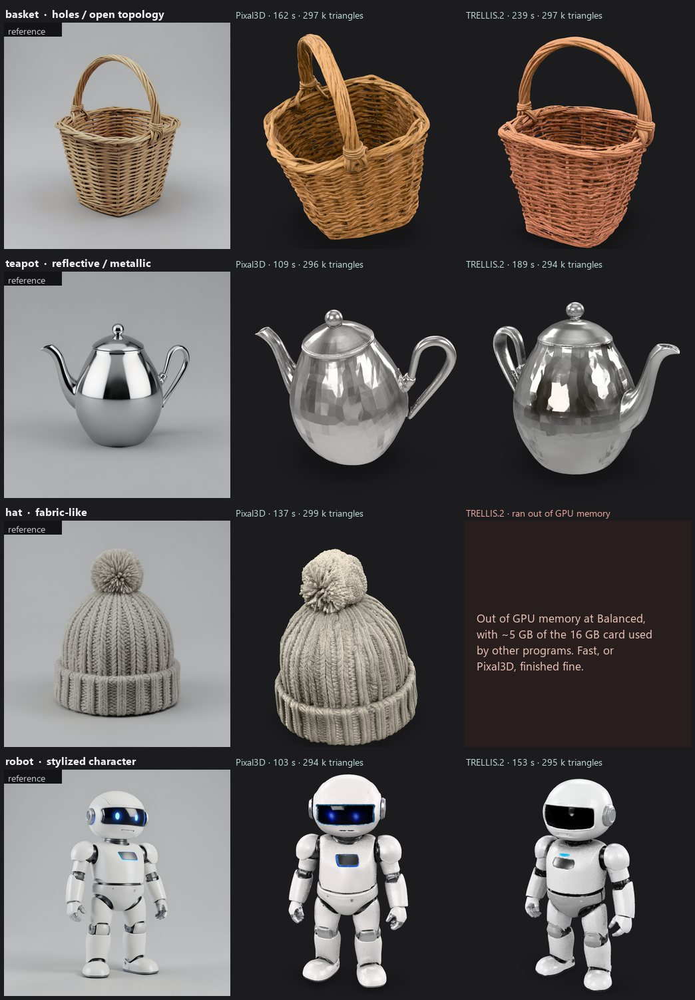

# Quality presets and evaluation

Everything here was **measured**, not assumed. The tools that produced the numbers are in the repository
(`scripts/bench_presets.py`, `scripts/evaluate_samples.py`) so you can repeat them on your own hardware.

## How the presets were chosen

*Maximum* is exactly the official Comfy-Org template default: the settings the model authors validated. *Balanced* and
*Fast* change only the knobs that cost memory and time without changing the model or the sampling steps. The single
source of truth is [`data/presets.json`](../data/presets.json); the apps are generated from it.

| Setting (what it controls) | Fast | **Balanced** | Maximum |
| --- | --- | --- | --- |
| Shape detail: refined voxel grid | 1024 | **1536** | 1536 |
| Clean-up remesh grid | 512 | **768** | 768 |
| Polygon budget of the exported mesh | 100 k | **300 k** | 700 k |
| Colour / metallic / roughness texture | 2048 px | **2048 px** | 4096 px |
| Normal map | 1024 px | **2048 px** | 2048 px |
| Ambient-occlusion map | 512 px | **1024 px** | 1024 px |
| Diffusion steps | upstream (12 / 20 / 12 / 12) | **same** | same |

Why this shape: the 1536 shape grid is where detail comes from, so *Balanced* keeps it; the polygon budget and the 4096
texture are what make files and GPU memory large (the UV-unwrap and texture-bake stages are the heaviest), so *Balanced* trims
those. *Fast* also drops the shape grid to 1024, which is Pixal3D's own low-memory setting. The sampler step counts are never
reduced: fewer steps visibly hurt quality for little time saved.

## Measured results

NVIDIA RTX 5080 (16 GB), Windows 11, ComfyUI 0.38.0, torch 2.14.0+cu130, models already loaded (warm), a different
seed per run, one 1024 px picture (a detailed axe). Other programs held 3 to 10 GB of the GPU's memory during these runs.

| Quality | Pixal3D time | Pixal3D mesh | TRELLIS.2 time | TRELLIS.2 mesh |
| --- | --- | --- | --- | --- |
| Fast | **38 s** | 100 k triangles, 13 MB GLB | 53 s | 97 k triangles, 15 MB |
| **Balanced** | **81 s** | 299 k triangles, 30 MB | 137 s | 295 k triangles, 30 MB |
| Maximum | **111 s** | 698 k triangles, 68 MB | 145 s | 692 k triangles, 67 MB |

All six runs finished without running out of memory. The GPU's total memory use peaked at about 14 to 15 GB of 16 GB
while ComfyUI was working: ComfyUI's *dynamic VRAM* uses whatever is free and moves model weights in and out as
needed, so the peak shows what was *available*, not the minimum required. We could not test cards with less memory;
reports from other users of the same pipeline show 12 GB cards running out of memory at the old *Maximum* settings
(a fix landed upstream in ComfyUI 0.35, which Local3D includes), and a 16 GB card finishing at the defaults.
**On 12 GB or less start with *Fast* or *Balanced*.**

**What the presets actually change.** With the *same picture, model and seed* (an axe, run at all three presets):

* *Balanced* and *Maximum* come out almost identical: the same shape and materials, with *Maximum* slightly crisper in the fine
  surface detail. For about 20 % less time (68 s against 84 s on this run), a 30 MB file instead of 67 MB, and less GPU memory,
  *Balanced* is the right default.
* *Fast* (39 s) is a **rougher preview**: the lower shape resolution softens fine detail and can even change how
  colours and materials are read, so do not treat it as a small version of the Balanced result.



Input picture: `viking_wolf_rune_axe.png` from Comfy-Org/workflow_templates (MIT); the figure shows Local3D output generated from it.

## Prompt to 3D timings

Prompt to 3D adds the reference picture (FLUX.2 klein: about 6 s for four candidates, a few seconds for one) in front of the same 3D stages, but the
picture model and the 3D model do not both fit in 16 GB at once, so ComfyUI swaps them in and out. Measured on the same RTX 5080 with a fresh seed each run:

| Quality | Time |
| --- | --- |
| Fast | 45 to 53 s |
| Balanced | 102 to 119 s in the benchmark runs; 182 s for the first run after a clean install (models loading) and 191 s for the next run in that session |

Treat Balanced as "two to three minutes". The numbers include whatever else was using the GPU.

## Output: High fidelity or Game asset

*Output* changes only the post-processing, so ComfyUI can **re-use the generated shape**:

| Output | Triangles | Textures | File (owl) |
| --- | --- | --- | --- |
| **High fidelity** (default) | the Quality preset's budget (100 k / 300 k / 700 k) | the preset's size | 23 MB |
| **Game asset** | at most 30 000 | at most 2048 px | 12 MB |

Normal and ambient-occlusion maps are baked from the full-detail mesh *before* it is decimated, which is why a 30 k-triangle
asset looks nearly identical to the 300 k one:



**3D-print optimization is not offered.** ComfyUI Core cannot guarantee a watertight, printable mesh (meshes can contain an
inner shell, upstream issue #16147), and promising "printable" would be dishonest. Use the viewer's STL export and your slicer's
repair tools.

## Re-running and caching

ComfyUI caches every stage whose inputs did not change. Measured on the same machine, Balanced, same picture and seed:

| What you did | Time |
| --- | --- |
| first run | 95 s |
| press Run again with nothing changed | **0 s** (the finished result is reused) |
| change **Output** to Game asset | **36 s** (the generated shape is reused) |
| change **Quality** | the generation stages run again (ComfyUI's cache key includes upstream inputs, so Balanced to Maximum saved nothing: 119 s against 120 s with a new seed). Every run in this table used a new seed; to repeat a result, set the Seed control to *Fixed* |
| change the **picture**, **Model** or **Seed** | everything downstream of the change runs again |

## Mesh and file checks

The exported GLB was validated with the Khronos glTF Validator: one mesh, one PBR material, embedded PNG textures
(base colour, metallic-roughness, normal, occlusion), UVs, and correct accessors. The single finding is **54
near-zero normals out of 454,949 vertices** (0.012 %) from ComfyUI's normal-smoothing step. Renderers renormalise them, so nothing is
visibly wrong; it is an upstream cosmetic issue.

Known geometry limits (upstream, not specific to Local3D): the hidden back side is *estimated*; thin parts can merge or
disappear; meshes can contain an inner shell (invisible when viewing, relevant for 3D printing, ComfyUI issue #16147).

## Reference pictures for Prompt to 3D

A pretty picture is not automatically a good 3D reference. The 3D models first cut the object out, centre it and
re-frame it, so the picture needs one complete object, clear of the borders, on a plain background. The *3D-friendly*
option adds one fixed sentence to the prompt for exactly that, and `evaluate_samples.py` checks every candidate
automatically for: object touching the border (cropped), object size in frame (35 to 92 % of the picture) and background
noise. It does not judge the artwork.

## Evaluation set

Eight objects chosen to stress different things, each made from a generated reference picture and run through both
models at **Balanced** (one seed each; `scripts/evaluate_samples.py`). Nothing was cherry-picked: this is every run,
including the one that failed.

| Object | What it tests | Pixal3D | TRELLIS.2 | What we saw |
| --- | --- | --- | --- | --- |
| Red metal toolbox | simple hard-surface | 255 s\* | 562 s\* | clean; latches and handle readable on both |
| Steampunk pocket watch | detailed hard-surface | 115 s | 160 s | gears and crown kept; TRELLIS.2 shifted the brass toward brighter gold |
| Ceramic fox | organic | 158 s | 358 s\* | smooth and plausible on both |
| Spindle-back chair | thin structures | 88 s | 99 s | every spindle and leg kept by both |
| Wicker basket | holes / open topology | 162 s | 239 s | open top and loop handle kept by both; TRELLIS.2 drifted from straw to terracotta |
| Chrome teapot | reflective / metallic | 109 s | 189 s | **weak on both:** blotchy, faceted reflections |
| Knitted wool hat | fabric-like | 137 s | **ran out of GPU memory** | Pixal3D kept the knit pattern |
| Cartoon robot | stylized character | 103 s | 153 s | both fine; Pixal3D kept the blue visor, TRELLIS.2 made it black |

\* Slower than the benchmark because these were the first runs after models loaded and the machine was also running other
tests; use the benchmark table above for timing. Mesh size was 295 to 300 k triangles everywhere (the Balanced budget).




What this tells us (one picture per object and one seed, so read it as a pattern, not a verdict):

* **15 of 16 runs finished.** The failure was TRELLIS.2 at *Balanced* on the hat, out of GPU memory in the shape-decode
  stage while other programs held about 5 GB of the 16 GB card. *Fast*, or Pixal3D, finished the same picture. Local3D now
  explains this in plain words if it happens, and the Quality labels say which setting needs the most memory.
* **Pixal3D stayed closer to the picture's colours** (basket, robot, watch); TRELLIS.2 sometimes drifted in colour.
  Both kept thin spindles, open tops and small handles.
* **Shiny metal is the weak spot.** Reflections in the picture become baked blotches in the texture. Prefer matte or
  satin objects, or expect to repaint reflective ones.
* The hidden back sides are *estimates*: we have no ground truth to measure them against, so no accuracy figure is claimed.

### Reference-picture template

The *3D-friendly* wording was chosen by experiment (`scripts/evaluate_prompts.py`: 8 prompts, 3 batches of 4 pictures each,
96 pictures per wording), counting pictures that are complete, clear of the borders, a sensible size in frame and on a
plain background:

| Wording | Pictures that pass |
| --- | --- |
| your prompt, unchanged (*3D-friendly* off) | 46 of 96 (**48 %**) |
| first wording we tried ("centred, fully visible, nothing cropped") | 67 of 96 (70 %) |
| "about 60 % of the frame height" | 84 of 96 (88 %) |
| **"small in the frame with a wide empty margin" (shipped)** | **92 of 96 (96 %)** |

The first version of the check was wrong in an instructive way: it treated the soft shading of the grey backdrop as part of the
object and rejected perfectly good pictures. It now fits a smooth background surface through the picture's edge first, and
every picture it rejects is genuinely cropped or badly framed. It is still a heuristic about *framing*, not a judgement of the artwork.


## Repeat it

```
python scripts/bench_presets.py --capture <api prompt json> --output-dir <ComfyUI output> --matrix Fast:Auto,Balanced:Auto,Maximum:Auto
python scripts/evaluate_samples.py --captures <dir> --input-dir <ComfyUI input> --output-dir <ComfyUI output>
```
See [CONTRIBUTING.md](../CONTRIBUTING.md) for how to capture an app's API prompt.
